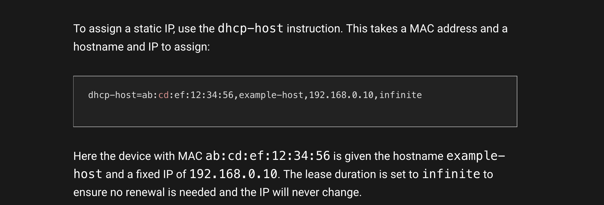

# Cloud exam Virtual Machine (part 1)

## Create a Template 

> [!TODO]
> Explain how to do this from the terminal

- Install [arm version of ubuntu server](https://ubuntu.com/download/server/arm)
- Unattended Install:

  - username: `user01`
  - password: `test`

### Configure the VBOx internal network.

Created an Host Only network, named CloudBasicNet

```
Mask: 255.255.255.0
Lower Bound: 192.168.56.2
Upper Bound: 192.168.56.199
```


#### Clone to create your other nodes:

```bash
VBoxManage clonevm "template" --name "master" --register --mode all
VBoxManage clonevm "template" --name "node-01" --register --mode all
VBoxManage clonevm "template" --name "node-02" --register --mode all
```

---

### Configure the nodes
Add a new network adapter on each machine: `internal network` naming it: "CloudBasicNet".

### Enable port forwarding
> To connect to the virtual machines we can enable port forwarding

##### Using a rule like this:

- Name -> ssh
- Protocol -> TCP
- HostIP -> 127.0.0.1
- Host Port -> some_port_number
- Guest Port -> 22

An example of how to do it from the terminal could be this:

_This example configures it both for the master and for the node-01._

> [!TIP]
> Your virtual machines names can be seen with: ```VBoxManage list vms```


```bash
VBoxManage modifyvm "master" --natpf1 "ssh,tcp,127.0.0.1,3022,,22"
VBoxManage modifyvm "node-01" --natpf1 "ssh,tcp,127.0.0.1,4022,,22"
```

## Master node configuration

> [!TIP]
> You can start the VM in headless mode from the terminal:
> ```bash
>  VBoxManage startvm "VM_name" --type headless
> You can also stop a machine and save the state of it with this command
>  ```
> ```bash
>  VBoxManage controlvm "VM_name" savestate
>  ```
You can now start the machine and ssh into it with: username, password and relative ssh port number.

```bash
ssh -p 3022 user01@127.0.0.1
```

- Try to remove the additional configuration you did to your `dnsmasq.conf`


